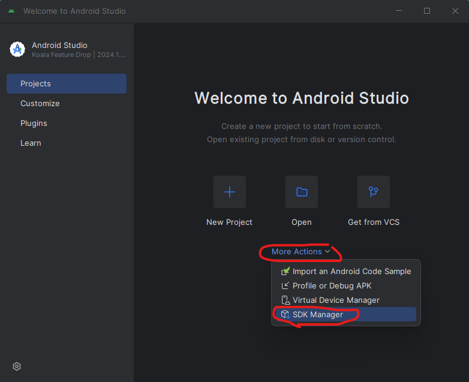
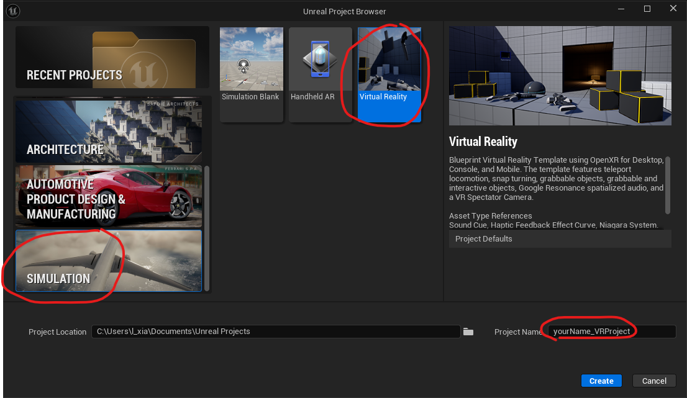
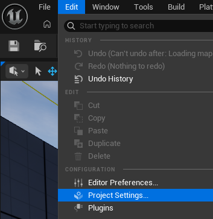
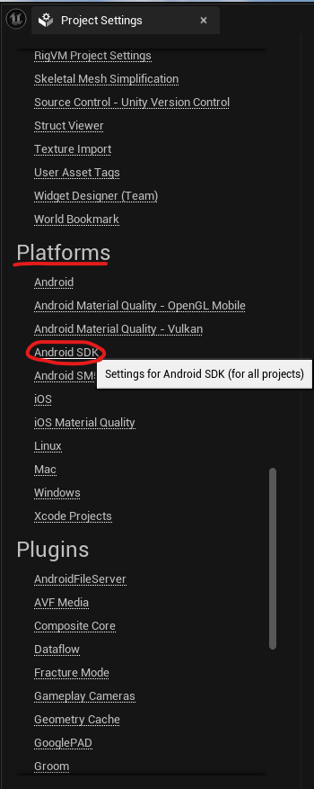
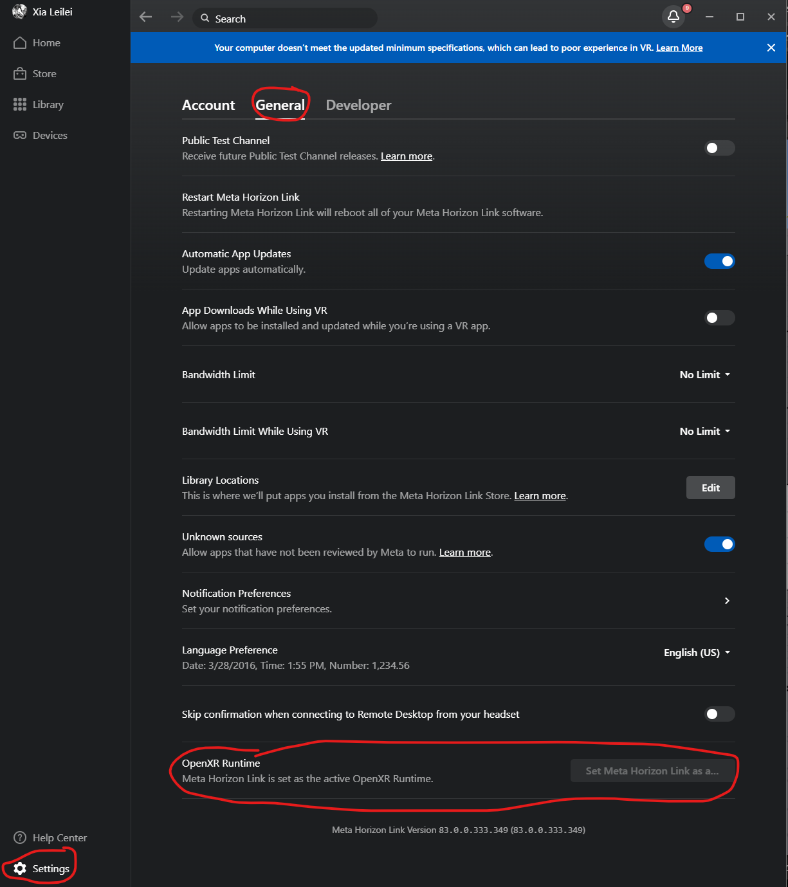
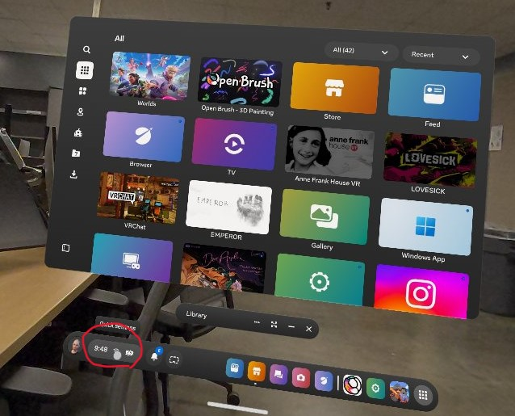
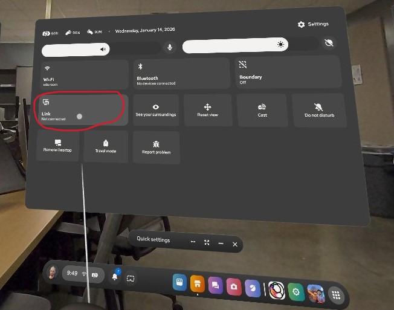
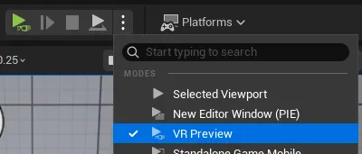
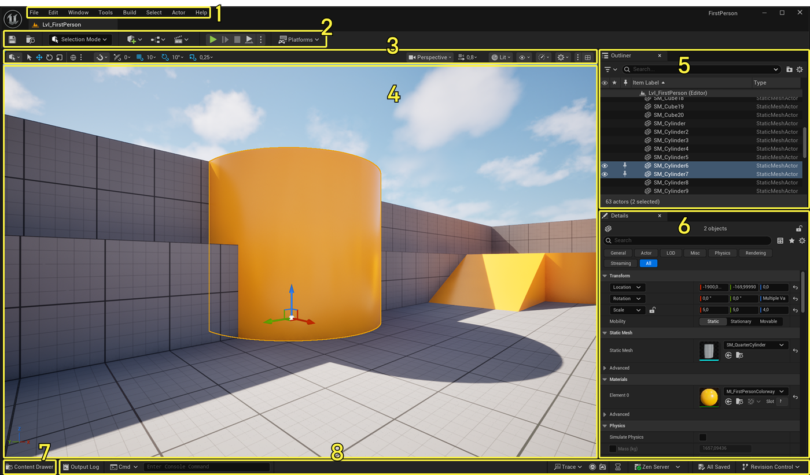
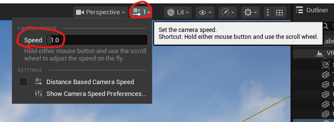

---
# You can also start simply with 'default'
theme: ./leilei-custom1
title: intro to Virtual Reality
info: |
  ## Set up and Unreal Crash Course
  Setting up your Unreal and Crash Course for Unreal Engine

# apply unocss classes to the current slide
class: text-center
# https://sli.dev/features/drawing
drawings:
  persist: false
# slide transition: https://sli.dev/guide/animations.html#slide-transitions
transition: slide-left
# enable MDC Syntax: https://sli.dev/features/mdc
mdc: true
---

# Set up and Unreal Crash Sourse

and 3D scanning


---
layout: two-cols
---

# Set up Casting

1. login to Meta Quest Developer Hub
{size=10%}

2. log in to your meta account

::right::

3. click Start casting
{size=120%}


---

# Set up Unreal

[Set Up Android SDK for 5.6](https://dev.epicgames.com/documentation/en-us/unreal-engine/set-up-android-sdk-ndk-and-android-studio-using-turnkey-for-unreal-engine?application_version=5.6)

---
level: 2
---

1. In "search", type in "cmd and open"
2. copy the following code and hit enter
```shell
cd "C:\Program Files\Epic Games\UE_5.6\Engine\Build\BatchFiles"
```
3. copy the following code and hit enter
```shell
.\RunUAT.bat Turnkey -Command=InstallSDK Platform=Android
```
yesterday's mistake was due to the small difference between PowerShell and command prompt, which are both commandline tools, but one can take a command without the ".\" and the other one doesn't quite in this case. The lesson is always have ".\" in the line, which stands for "in this folder".

---
level: 2
---

4. You will see the following
```shell
PS C:\Program Files\Epic Games\UE_5.6\Engine\Build\BatchFiles> .\RunUAT.bat Turnkey -Command=InstallSDK Platform=Android

Running AutomationTool...
Using bundled DotNet SDK version: 8.0.300 win-x64
Starting AutomationTool...
Parsing command line: Turnkey -Command=InstallSDK Platform=Android
Initializing script modules...
Total script module initialization time: 0.19 s.
Using C:\Program Files (x86)\Microsoft Visual Studio\2019\BuildTools\MSBuild\Current\Bin\MSBuild.exe
Executing commands...


Choose a type of Sdk to install:
  0) Cancel
 [1] Full or Auto Sdk
  2) Full Sdk
  3) AutoSdk
  4) Device Software / Flash
[Default: 1]
```
type in "1" and hit enter

---
level: 2
---

then you will see
```shell
Choose a platform:
  0) Cancel
 [1] Android
  2) All of the Above
[Default: 1]
```
type in "1" and hit enter key

then you will see:
```shell
Select an Sdk to install
MinAllowed_Sdk=r25b, MaxAllowed_Sdk=r29, Current_Sdk=r27c, Allowed_AutoSdk=r27c, Current_AutoSdk=
(Preferred: r27c
  0) Cancel
 [1] [Android] Android SDK r27c
[Default: 1]
```
type in "1" and hit enter key

---
level: 2
---

5. wait for the tools to process. The commandline will install android studio for you. It will pop up an Android Studio for you and open it. 

*optional: If not, you should can copy and edit the following code, paste it in your command prompt and hit enter
```shell
cd C:\Users\[yourUserName]\AppData\Local\Android\android-studio\bin
```
change the `[yourUserName]` part into your UNCG user name.
This is the location where your android studio is installed. This folder contains the exe for the file. 
Copy the following code, and then hit enter
```shell
.\studio64.exe
```

---
level: 2
---

6. It will open up this software, choose SDK manager

{size=80%}

---
level: 2
---

7. Check Android SDK Command-Line Tools (latest) and then click Apply. This downloads the Command-Line tools, which are needed to automatically configure Android Studio for UE. (needs override)


---
level: 2
---

8. install JDK
[install for Windows x64 microsoft-jdk-21.0.9-windows-x64.msi](https://aka.ms/download-jdk/microsoft-jdk-21.0.9-windows-x64.msi)
install them **for yourself**

search command prompt in your search bar, right click and "run as administrator" (needs admin override)

copy the directory below and change the yourUserName part as your UNCG username, check if the folder is correctly there

```shell
C:\Users\[yourUserName]\AppData\Local\Programs\Microsoft\jdk-21.0.9.10-hotspot
```

if it's there, copy the address, and replace the following `[jdk address]` part with the address above, hit enter (needs admin override)

```shell
setx -m JAVA_HOME “[jdk address]”
```
---


9. In Unreal Engine 5.6.1
Under Simulation->VR Project, name your project as yourName_VRProject
{size=90%}

---
layout: two-cols
level: 2
---

10. Go to menu bar->Edit->Project Setting


::right::

11. Go to Platforms -> AndroidSDK
{size=70%}

---
layout: two-cols
---

12. Under these forms, change each of them correspondingly

change the `[yourUserName]` to your uncg username

**a.** copy and paste
```shell
C:/Users/[yourUserName]/AppData/Local/Android/Sdk
```

**b.**  in your Explorer, on the address bar, paste the link in, and find a folder that's called "ndk"

::right::


find the folder in there, right click -> copy as path

{size=60%}

paste in b section

**c.** copy and paste
```shell
C:/Users/[yourUserName]/AppData/Local/Android/jdk-21.0.9
```
---
layout: two-cols
level: 2
---

(continue) 

change the `[yourUserName]` to your uncg username

**d.** copy and paste
```shell
matchndk
```

**e.** copy and paste
```shell
android-27
```
::right::

14. Once set, go back to the main interface, on the top bar beside the play button, in Platforms → Device Manager, You should be able to see Quest 3 in the Android section. Update Device.

{size=80%}


---
level: 2
---

15. Connect Quest 3 through Link Cable, open **Meta Horizon Link** to set up the headset, in Setting → General, on the  bottom, select OpenXR Runtime to true ✔️
{size=40%}

---
level: 2
layout: two-cols
---

16. In Quest 3, Select the time bar with the icon in “Quick Setting”, connect the headset with the link cable, Go into Link

::right::


---

now in Unreal Engine, if clicking the three dots beside the play button, you would be able to see VR Preview turn on  



try things out!

---
layout: center
---

# Unreal Crash Course

---
level: 2
class: interface
---

# [Interface](https://dev.epicgames.com/documentation/en-us/unreal-engine/unreal-editor-interface)



<p style="font-size:var(--text-lg);position:absolute;left:300px;color:yellow;">Menu Bar</p>
<p style="font-size:var(--text-lg);position:absolute;left:420px;top:3%;color:yellow;">Main Toolbar</p>
<p style="font-size:var(--text-lg);position:absolute;left:500px;top:6%;color:yellow;">Viewport Toolbar</p>
<p style="font-size:var(--text-lg);position:absolute;left:500px;top:15%;color:black;">Level Viewport</p>
<p style="font-size:var(--text-lg);position:absolute;left:80%;top:15%;color:yellow;">Outliner</p>
<p style="font-size:var(--text-lg);position:absolute;left:80%;top:47%;color:yellow;">	
Details panel</p>
<p style="font-size:var(--text-lg);position:absolute;left:12%;top:85%;color:black;">	
Content Drawer<br></p>
<p style="font-size:var(--text-lg);position:absolute;left:45%;top:85%;color:black;">	
Bottom Toolbar</p>


---
level: 2
---

# Navigation

try the following:
1. hold and drag **mouse left key** in the window, try drag up,down,left,right
2. hold and drag **mouse middle wheel** in the window, try drag up,down,left,right
3. **scroll mouse middle wheel** in the window
4. hold and drag **mouse right key** in the window, try drag up,down,left,right
5. press and hold mouse middle wheel, click your 'A' 'D' 'W' 'S' key on your keyboard
6. use your left key to click and select an object in the scene (it will be surrounded by yellow outline) click **"F"**

Camera Speed

go to **viewport toolbar**
set your camera speed 


---

# Add things to your scene