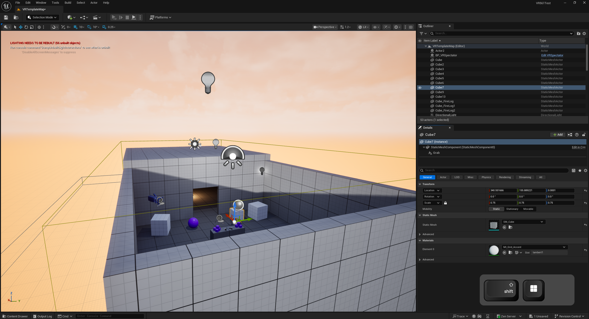
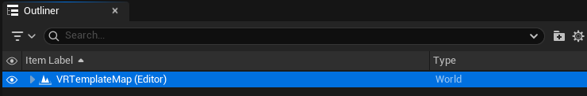
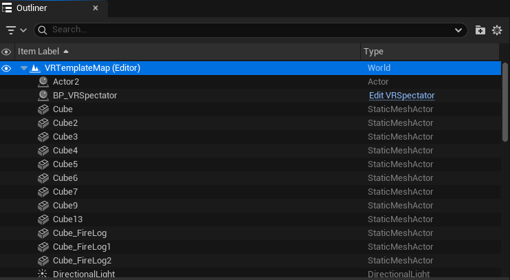
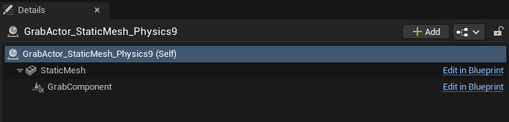
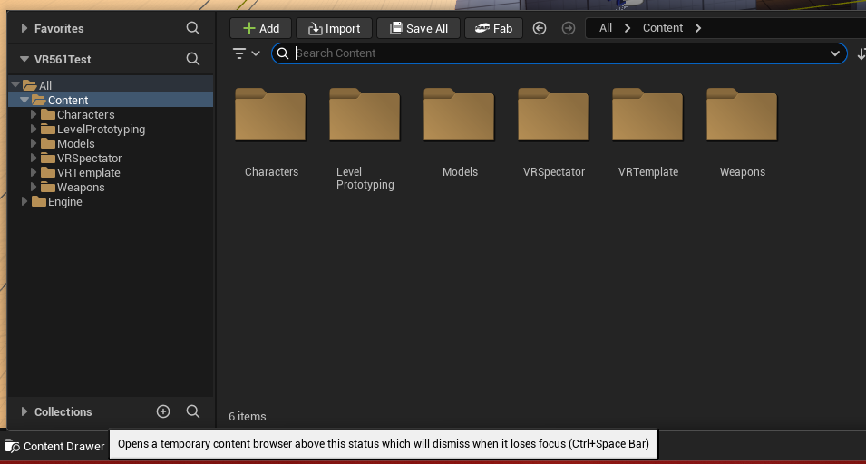
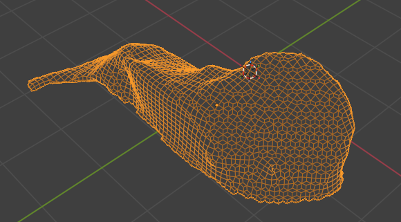
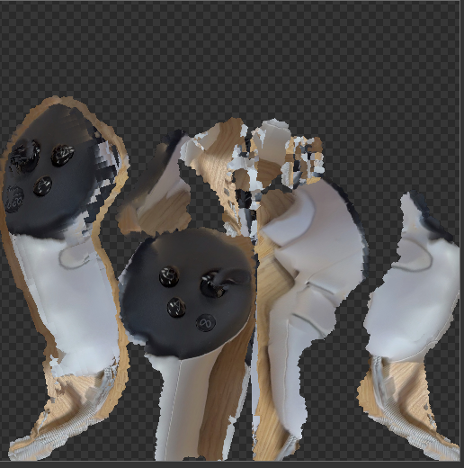

---
# You can also start simply with 'default'
theme: ./leilei-custom1
title: Unreal Crash Course
info: |
  ## Crash Course to Unreal Engine 5.6
class: text-center
drawings:
  persist: false
transition: slide-left
mdc: true
---

# Unreal Crash Course
### A Beginner's Guide to UE 5.6

---
layout: two-cols
---

# Unreal Terminology

## Project
The "Container" for everything.

* Contains all content and code for your game.
* Represented by a folder on your hard drive or on your desktop.

::right::

## Level

Think of a Level (often called a Map) as a specific "Scene" in a movie or a "Room" in a building.
* Everything you see during gameplay exists inside a Level.
* The "World" is usually just the currently loaded Level.

---
layout: two-cols
---

## Actor
Anything that can be placed in a Level.

* **Analogy:** A prop or character on a stage.
* If it has a **Location**, **Rotation**, or **Scale**, it is an Actor.
* Examples: Static Mesh Actor, Camera, Light, Player Start.

::right::

## Component
Sub-objects within an Actor.

* **Analogy:** The organs or tools an Actor carries.
* Actors are just empty containers; **Components** give them function.
* Examples:
    * `StaticMeshComponent` (The visual look)
    * `PointLightComponent` (Emits light)
    * `MovementComponent` (Logic for moving)

---
layout: two-cols
---

## Content Drawer
Your File Explorer.

* **Shortcut:** `Ctrl + Space`
* Where all your assets live (Textures, Sounds, Blueprints).
* **Tip:** It mirrors the folder structure on your computer.

::right::

## Blueprint
Visual Scripting (No Code required).

It specify the behaviour or the interaction that happens with different component, or specify the material

---
layout: two-cols
---

## Mesh
The 3D Geometry shape. 

built from points (vertices) connected by lines (edges) to form flat surfaces (faces or polygons) 

::right::

## Material
The "Paint" on the Mesh.

* Determines the color, shininess, roughness, and transparency.
* Uses a graph-based shader editor.
* **PBR (Physically Based Rendering):** Unreal uses real-world logic for light interaction.

---

# Sunlight Position

<iframe width="560" height="315" src="https://www.youtube.com/embed/NY1Ag2As9gs?si=BI2XVdr2hcvPYQJ9" title="YouTube video player" frameborder="0" allow="accelerometer; autoplay; clipboard-write; encrypted-media; gyroscope; picture-in-picture; web-share" referrerpolicy="strict-origin-when-cross-origin" allowfullscreen></iframe>

Watch the video, change the sunlight position in your scene

---

# how to create landscape

<iframe width="560" height="315" src="https://www.youtube.com/embed/FSsOS6M2u1s?si=sZRKbEOrP30_bzYG" title="YouTube video player" frameborder="0" allow="accelerometer; autoplay; clipboard-write; encrypted-media; gyroscope; picture-in-picture; web-share" referrerpolicy="strict-origin-when-cross-origin" allowfullscreen></iframe>

Watch the video, create a landscape for your scene

---

# Unreal material

<iframe width="560" height="315" src="https://www.youtube.com/embed/iZgbzwBQTPY?si=4gCB8Jrs-_D1zsH3" title="YouTube video player" frameborder="0" allow="accelerometer; autoplay; clipboard-write; encrypted-media; gyroscope; picture-in-picture; web-share" referrerpolicy="strict-origin-when-cross-origin" allowfullscreen></iframe>